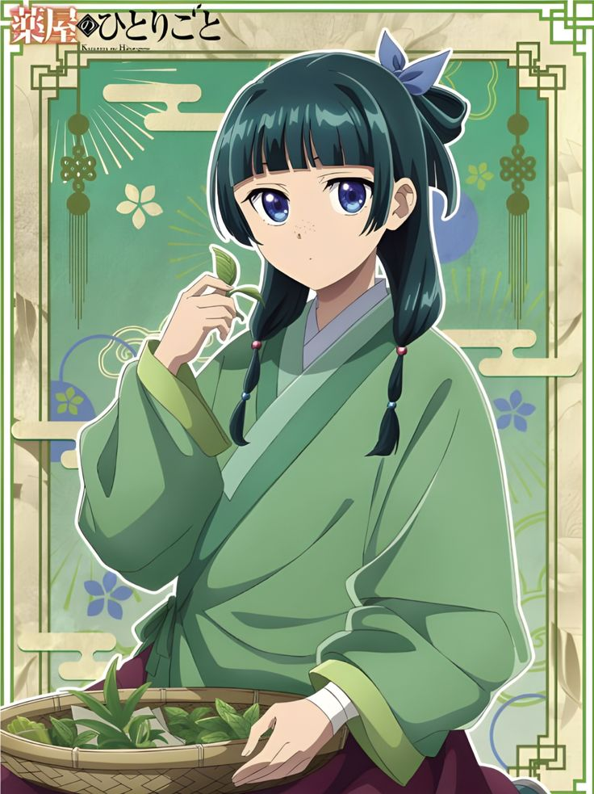

<html lang="en">
<head>
  <meta charset="UTF-8">
  <meta name="viewport" content="width=device-width, initial-scale=1.0">
  <title>My Webpage</title>
  
</head>
<body> 
  <h1>JUJUTSU KAISEN</h1>
  
  

    

  
    

    

  
    

     

  
    

     

  
    

  

   

</body>
</html>
